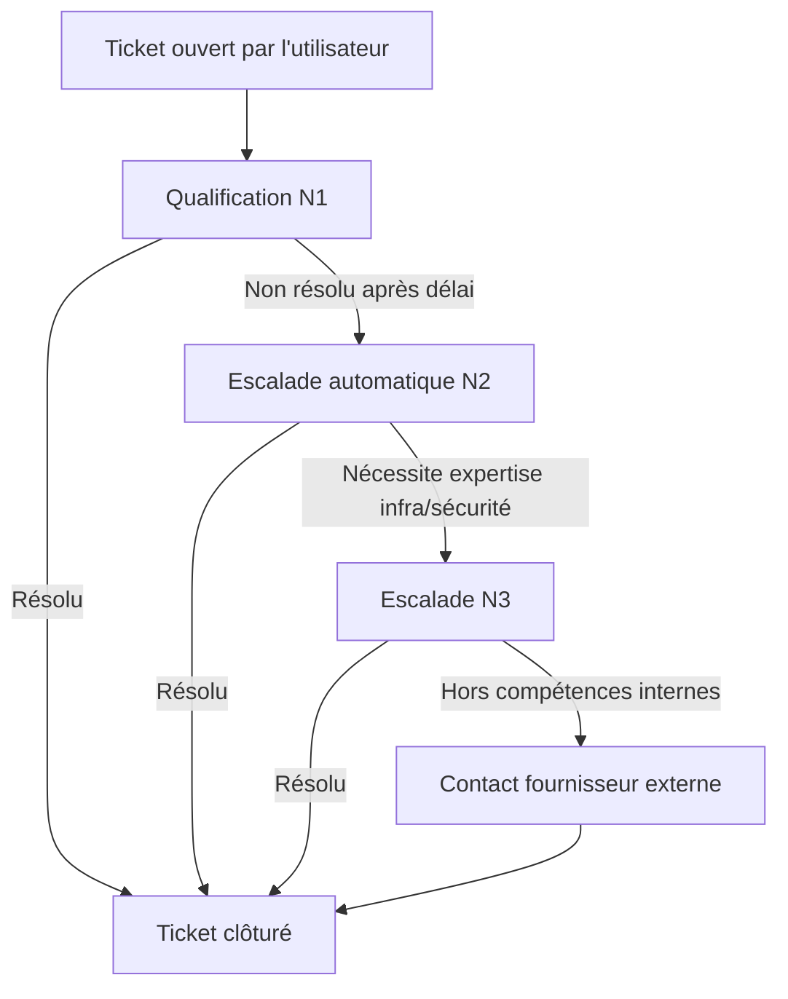

# Bonus — Matrice d'escalade et schéma du workflow

Ce fichier n'est pas demandé dans le sujet, mais il complète bien la Partie 1 et la Partie 3 : il rend visible la règle d'escalade qu'on a proposée.

## Matrice d'escalade proposée

| Niveau | Effectif | Type de demandes | Déclenchement de l'escalade |
|---|---|---|---|
| N1 | 5 techniciens | Mots de passe, comptes, imprimantes, petits soucis matériels | Escalade au N2 si non résolu après 4h (critique) ou 24h (normal) |
| N2 | 2 techniciens | Réseau, serveurs applicatifs, comptes AD complexes | Escalade au N3 si le problème touche l'infrastructure ou la sécurité |
| N3 | 1 technicien | Infrastructure critique, sécurité, architecture | Contact du fournisseur externe si le sujet dépasse les compétences internes |

## Schéma du parcours d'un ticket

Ce schéma montre bien pourquoi la règle d'escalade automatique (Partie 1 et 3) est utile : sans elle, un ticket peut rester bloqué à l'étape B indéfiniment, alors qu'avec la règle, il progresse automatiquement vers le bon niveau.
